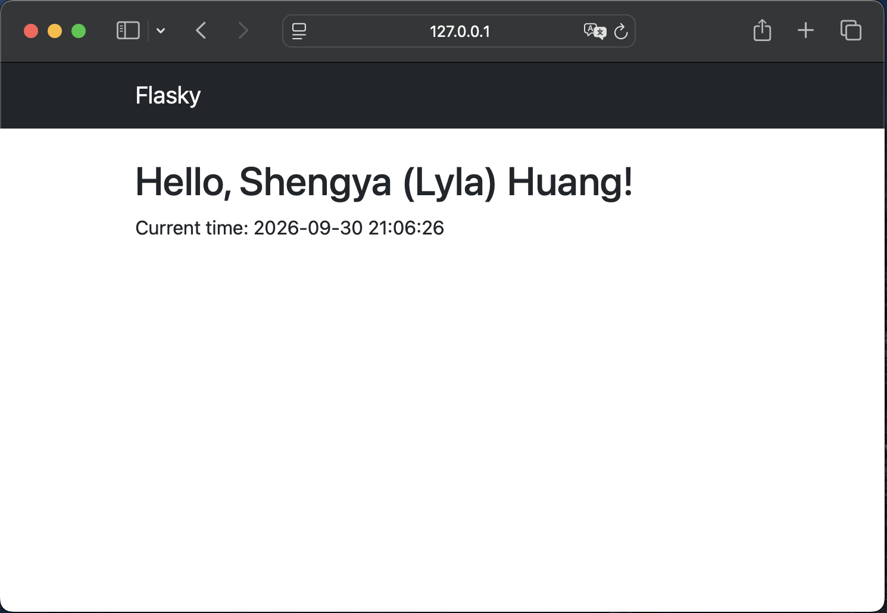
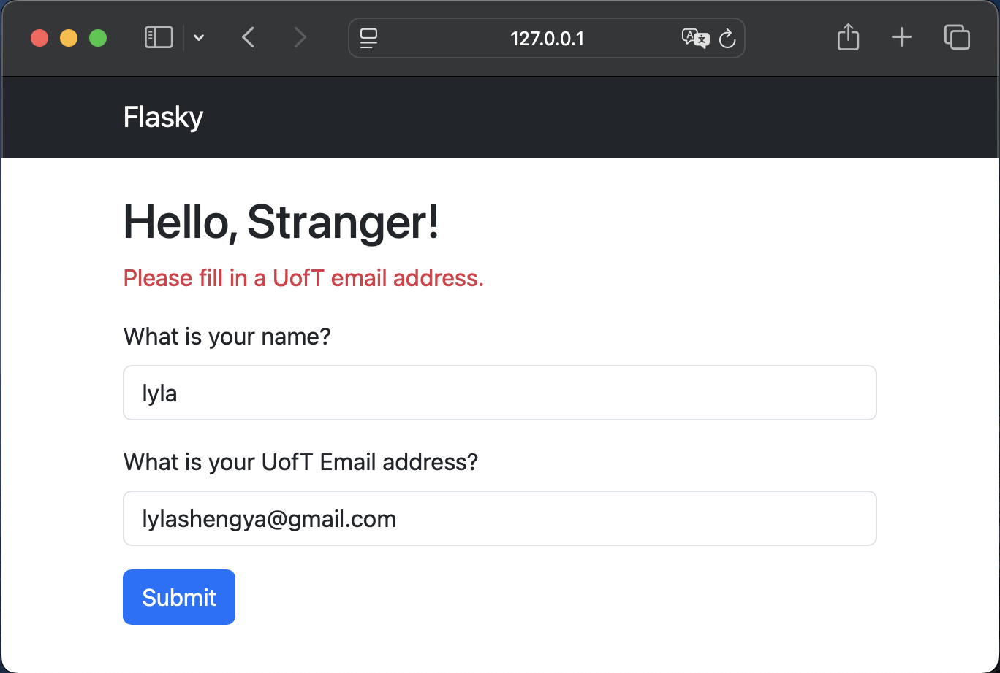

# ECE444 PRA3 - Flask and Docker

Name: Shengya (Lyla) Huang

This repo is a clone of https://github.com/miguelgrinberg/flasky.

## Activity 1.3 - Flask Templates and Bootstrap

Reproduced and modified the Flask template example.

- Used `render_template()` to render an HTML template.
- Passed my name and the current time from Flask to the template.
- Added Bootstrap styling and a navigation bar.

## Activity 1.4 - Flask Forms and Validation

Extended the Flask application with a web form and email validation.

- Added a name and email input form using Flask-WTF.
- Added validation to check for a valid email address.
- Added an additional check to require a UofT email address.
- Displayed an error message when a non-UofT email is submitted.

